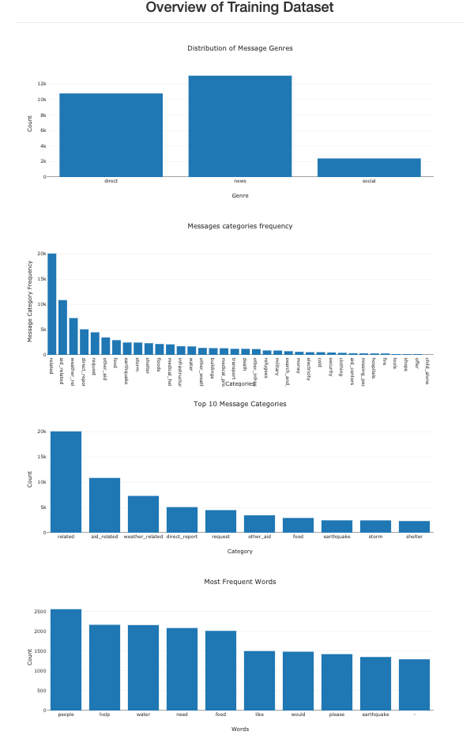
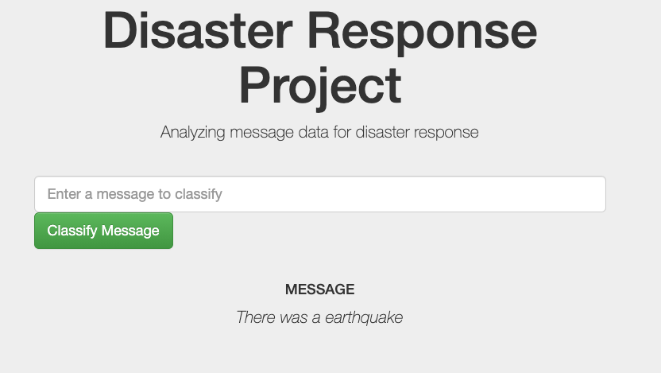
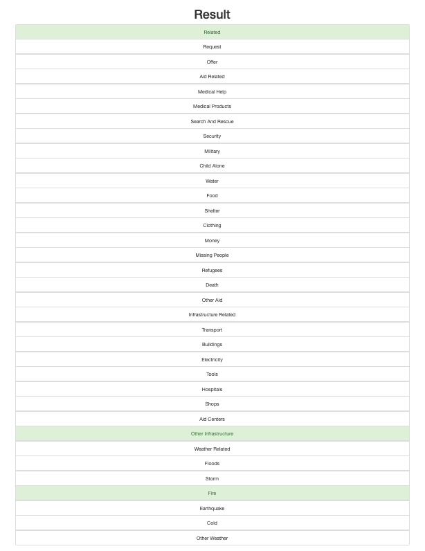

    
### Table of Contents
1. [Description](#description)
2. [Installation](#installation)
3. [File Descriptions](#files)
4. [Instructions](#instructions)
5. [Results](#results)
6. [Licensing, Authors, and Acknowledgements](#licensing)

## Description<a name="description"></a>

In this project, I analyzed disaster data from [Figure Eight](https://appen.com/) to build a Natural Language Processing (NLP) model for an API that classifies disaster messages.

This project include:

1. **Processing data**: The dataset contains real messages that were sent during disaster events. I builed an Extract Transform and Load (ETL) pipeline to extract data from dataset, clean data and save data to a SQLlite DB.
2. **Building model**: Build an NLP pipeline to to categorize these events so that you can send the messages to an appropriate disaster relief agency.
3. **Web App**: Which an show model results in real time.

## Installation <a name="installation"></a>

Reguired installations:

* Jupyter Notebooks (Anaconda Distribution)
* Python 3.8.5

Required packages:

* Machine Learning Libraries: NumPy, SciPy, Pandas, Sciki-Learn
* Natural Language Process Libraries: NLTK
* SQLlite Database Libraqries: SQLalchemy
* Model Loading and Saving Library: Pickle
* Web App and Data Visualization: Flask, Plotly


## File Descriptions <a name="files"></a>

1. data:
    * `ETL Pipeline Preparation.ipynb`: process_data.py development procces
    * `process_data.py`: This python excutuble code takes as its input csv files containing message data and message categories (labels), and then creates a SQL database
    * `disaster_messages.cvs`: contains sample messages dataset.
    * `disaster_categories.cvs`: contains sample messages dataset.
    
2. model:
    * `ML Pipeline Preparation.ipynb`: train_classifier.py. development procces
    * `train_classifier.py`: This code trains the ML model with the SQL data base
    
3. app:
    * `run.py` :iniate the web app.


## Instructions: <a name = "instructions"></a>
1. Run the following commands in the project's root directory to set up your database and model.

    * To run ETL pipeline that cleans data and stores in database 
    ```bash
    python process_data.py disaster_messages.csv disaster_categories.csv disaster.db
    ```
    * To run ML pipeline that trains classifier and saves 
    ```bash
    python train_classifier.py ../data/disaster.db
    ```

2. Run the following command in the app's directory to run your web app. 
```bash
python run.py
```

3. Go to http://0.0.0.0:3001/ Or Go to http://localhost:3001/


## Results<a name="results"></a>

1. Plot Demos



2. Classification Demo



## Licensing, Authors, Acknowledgements<a name="licensing"></a>

This app was completed as part of the [Udacity Data Scientist Nanodegree](https://www.udacity.com/course/data-scientist-nanodegree--nd025).

